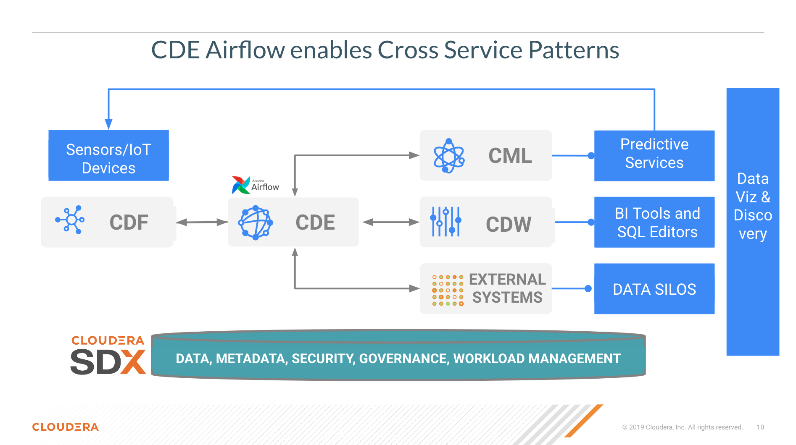

# Spark Pipelines with Airflow in CDE

## Objective

CDE is the Cloudera Data Engineering Service, a serverless containerized managed service for Cloudera Data Platform designed for Large Scale Batch Pipelines with Spark, Airflow and Iceberg. It allows you to submit batch jobs to auto-scaling virtual clusters. As a serverless service, CDE enables you to spend more time on your applications, and less time on infrastructure.

CDE allows you to create, manage, and schedule Apache Spark jobs without the overhead of creating and maintaining Spark clusters. With CDE, you define virtual clusters with a range of CPU and memory resources, and the cluster scales up and down as needed to run your Spark workloads, helping to control your cloud costs.

In this project we will deploy two CDE Spark Jobs and one CDE Airflow Job and demonstrate how the Airflow DAG can consume a value computed by the first Spark Job and then use it to orchestrate the next Spark Job in the pipeline.

This example demonstrates how to implement CDE pipelines that don't just involve running Spark Jobs sequentially but with and/or as a result of values computed in upstream jobs.  



## Project Requirements

In order to execute the Hands On Labs you need:

* A Spark 3 and Iceberg-enabled CDE Virtual Cluster (Azure, AWS and Private Cloud ok).
* Familiarity with Python, PySpark and AIrflow DAGs is highly recommended.
* No script code changes are required.

## Project Setup

Clone this GitHub repository to your local machine or the VM where you will be running the script.

```
mkdir ~/Documents/spark_pipelines_with_airflow_CDE
cd ~/Documents/spark_pipelines_with_airflow_CDE
git clone https://github.com/pdefusco/Spark_Pipelines_with_Airflow_CDE.git
```

Alternatively, if you don't have git installed on your machine, create a folder on your local computer; navigate to [this URL](https://github.com/pdefusco/Spark_Pipelines_with_Airflow_CDE.git) and manually download the files.

## Step by Step Instructions


## Conclusions & Next Steps

CDE is the Cloudera Data Engineering Service, a containerized managed service for Spark and Airflow.

If you are exploring CDE you may find the following tutorials relevant:

* [Spark 3 & Iceberg](https://github.com/pdefusco/Spark3_Iceberg_CML): A quick intro of Time Travel Capabilities with Spark 3.

* [Simple Intro to the CDE CLI](https://github.com/pdefusco/CDE_CLI_Simple): An introduction to the CDE CLI for the CDE beginner.

* [CDE CLI Demo](https://github.com/pdefusco/CDE_CLI_demo): A more advanced CDE CLI reference with additional details for the CDE user who wants to move beyond the basics.

* [CDE Resource 2 ADLS](https://github.com/pdefusco/CDEResource2ADLS): An example integration between ADLS and CDE Resource. This pattern is applicable to AWS S3 as well and can be used to pass execution scripts, dependencies, and virtually any file from CDE to 3rd party systems and viceversa.

* [Using CDE Airflow](https://github.com/pdefusco/Using_CDE_Airflow): A guide to Airflow in CDE including examples to integrate with 3rd party systems via Airflow Operators such as BashOperator, HttpOperator, PythonOperator, and more.

* [GitLab2CDE](https://github.com/pdefusco/Gitlab2CDE): a CI/CD pipeline to orchestrate Cross-Cluster Workflows for Hybrid/Multicloud Data Engineering.

* [CML2CDE](https://github.com/pdefusco/cml2cde_api_example): an API to create and orchestrate CDE Jobs from any Python based environment including CML. Relevant for ML Ops or any Python Users who want to leverage the power of Spark in CDE via Python requests.

* [Postman2CDE](https://github.com/pdefusco/Postman2CDE): An example of the Postman API to bootstrap CDE Services with the CDE API.

* [Oozie2CDEAirflow API](https://github.com/pdefusco/Oozie2CDE_Migration): An API to programmatically convert Oozie workflows and dependencies into CDE Airflow and CDE Jobs. This API is designed to easily migrate from Oozie to CDE Airflow and not just Open Source Airflow.

For more information on the Cloudera Data Platform and its form factors please visit [this site](https://docs.cloudera.com/).

For more information on migrating Spark jobs to CDE, please reference [this guide](https://docs.cloudera.com/cdp-private-cloud-upgrade/latest/cdppvc-data-migration-spark/topics/cdp-migration-spark-cdp-cde.html).

If you have any questions about CML or would like to see a demo, please reach out to your Cloudera Account Team or send a message [through this portal](https://www.cloudera.com/contact-sales.html) and we will be in contact with you soon.
